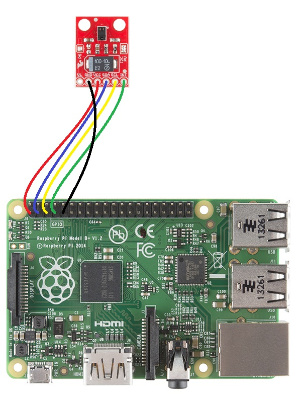

# APDS-9960-PY
Python library for SparkFun APDS9960 RGB and Gesture Sensor

This library is intended as a python library for interfacing with the APDS9960 RGB and Gesture Sensor, it follows the same style as the Arduino C library (on which this is based) provided by Sparkfun available here https://github.com/sparkfun/APDS-9960_RGB_and_Gesture_Sensor/tree/master/Libraries/Arduino.

Current status:
All functionality working seems to be functional.
Examples show use of interrupts for proximity and gesture handling.
Todo:
More testing with different sensitivityes etc for gestures as they seem very picky at the moment.
Code tidyup
Docstrings
Python module stuff (to make it something installable, need to look up how to do that).
# APDS 9960 hookup
APDS 9960 hookup (example with Raspberry Pi B+), it should work with others Raspberry Pi models. [JPG source](https://justinwoodman.files.wordpress.com/2014/11/apds-9960-hookup.jpg).

